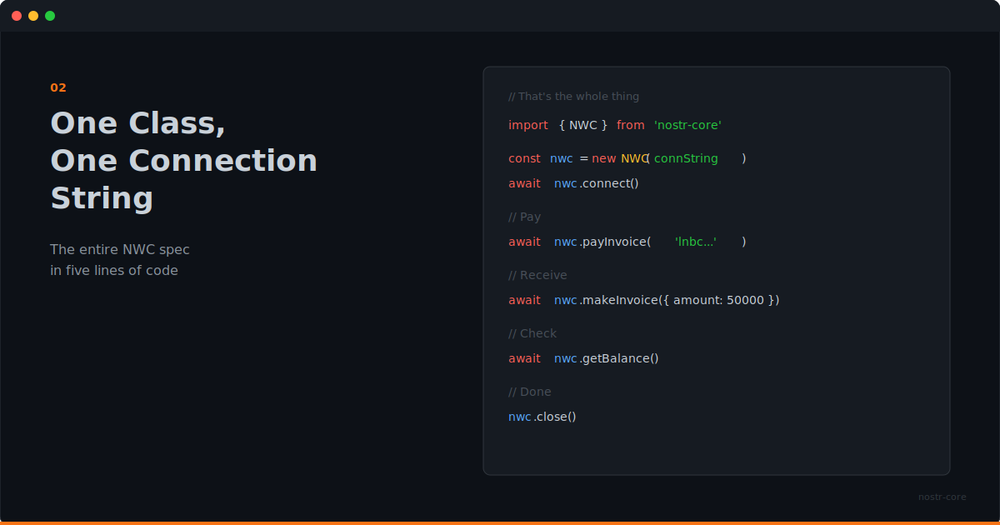

<p align="center">
  
</p>

# One Class, One Connection String

**The entire NWC spec in five lines of code. That's not a simplification; it's the actual API.**

---

## Payment Integration Shouldn't Be Hard

Every payment integration story starts the same way. You read the docs. You install the SDK. You create an account. You get API keys. You configure webhooks. You handle OAuth flows. You write error handling for seventeen different failure modes.

By the time you've sent your first payment, you've written more infrastructure code than product code.

NWC was designed to be simpler than that. And nostr-core takes that simplicity seriously.

## Five Lines

```ts
import { NWC } from 'nostr-core'

const nwc = new NWC('nostr+walletconnect://...')
await nwc.connect()
const { preimage } = await nwc.payInvoice('lnbc...')
nwc.close()
```

That's a complete payment. Import, connect, pay, close.

The connection string contains everything: the wallet's public key, the relay to communicate through, and your secret key. No separate config files. No environment variables for client IDs and secrets. One string.

## What the NWC Class Handles

Behind those five lines, nostr-core is doing real work.

**Encryption auto-detection.** Some wallets use NIP-04 (AES-CBC). Others support NIP-44 (ChaCha20). nostr-core checks what the wallet supports and uses the best available option. You don't configure this. It just works.

**Relay management.** The class connects to the relay specified in the connection string, subscribes to the right filters, and handles the WebSocket lifecycle. Reconnection, subscription management, cleanup on close.

**Request/response matching.** NWC is asynchronous over Nostr relays. nostr-core matches each response to its request, handles timeouts, and surfaces errors through a typed hierarchy.

**Event signing.** Every NWC request is a signed Nostr event. nostr-core handles the signing, serialization, and verification internally.

You don't see any of this. You see `payInvoice()` and get a preimage back.

## The Full Surface

The NWC class exposes every NIP-47 method:

- `getBalance()` - how much is in the wallet
- `payInvoice()` - pay a BOLT-11 invoice
- `makeInvoice()` - create an invoice to receive
- `listTransactions()` - payment history
- `payKeysend()` - pay a node directly
- `payLightningAddress()` - resolve and pay a Lightning address
- `payLightningAddressFiat()` - convert fiat to sats and pay
- `getInfo()` - wallet metadata
- `getBudget()` - spending limits
- `signMessage()` - sign with the wallet key

Plus event listeners for real-time payment notifications:

```ts
nwc.on('payment_received', (notification) => {
  console.log('Incoming:', notification.notification.amount, 'msats')
})
```

That's the full wallet API. One class, one import.

## Errors That Tell You What Happened

When something goes wrong, you get a specific error, not a generic exception with a string message.

```ts
try {
  await nwc.payInvoice('lnbc...')
} catch (err) {
  if (err instanceof NWCWalletError) {
    // The wallet said no: insufficient balance, expired invoice, etc.
  } else if (err instanceof NWCTimeoutError) {
    // Wallet didn't respond in time
  } else if (err instanceof NWCConnectionError) {
    // Couldn't reach the relay
  }
}
```

Eight error classes in a clean hierarchy. Your error handling can be as specific or as general as you need.

## Lightning Addresses in One Call

Lightning Address resolution normally means fetching a well-known URL, parsing the LNURL response, creating an invoice, then paying it. nostr-core wraps that entire flow:

```ts
await nwc.payLightningAddress('user@example.com', 1000)
```

One thousand sats to a Lightning address. One line.

Need fiat conversion? That's built in too:

```ts
await nwc.payLightningAddressFiat('user@example.com', 5, 'usd')
```

Five dollars, converted to sats at the current rate, paid to a Lightning address. Still one line.

## The DX Argument

Developer experience isn't about making things pretty. It's about reducing the distance between your intention and your code.

If you want to pay an invoice, the code should say "pay this invoice." If you want to listen for payments, the code should say "when a payment arrives, do this." The protocol complexity should be invisible unless you need to see it.

That's what one class and one connection string gives you. The intent is the code.

---

**Start with `npm install nostr-core` and a connection string.** That's all you need.

**[GitHub](https://github.com/nostr-core-org/nostr-core)** · **[API Docs](https://github.com/nostr-core-org/nostr-core/tree/main/docs)**
