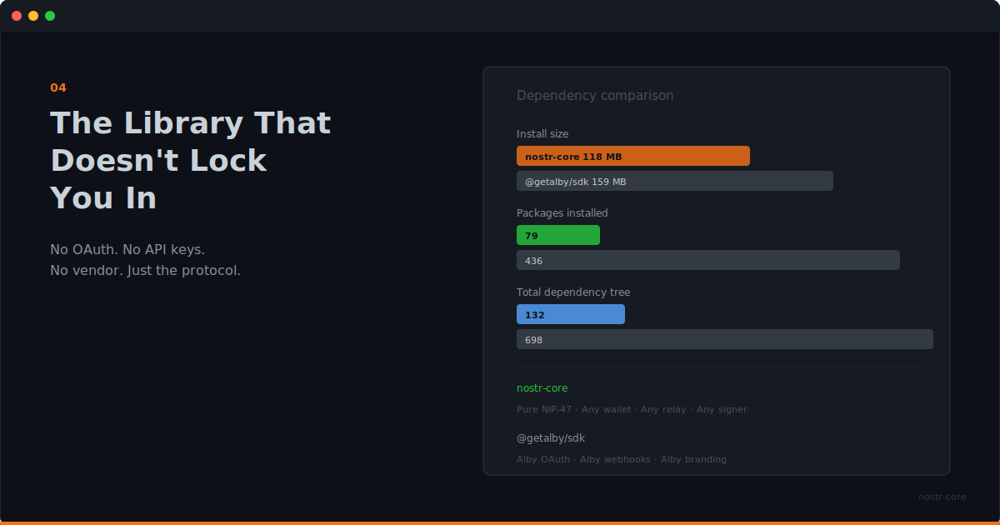

  

# The Library That Doesn't Lock You In

**No OAuth. No API keys. No vendor. Just the protocol.**

---

## Vendor Lock-In Is a Quiet Problem

It doesn't happen all at once. You pick an SDK because it's convenient. The docs are good. The getting-started example works in five minutes.

Then you notice the OAuth flow is specific to that provider. The error messages reference their dashboard. The WebSocket connection goes through their relay. The types assume their wallet service.

You're not building on a protocol anymore. You're building on someone's product. And the moment they change their terms, raise prices, or pivot, your app feels it.

## nostr-core Is Protocol-Only

There's no account to create. No API key to manage. No OAuth flow to implement. No webhooks to configure on someone else's platform.

nostr-core implements Nostr protocols (NIPs) and nothing else. When you connect to a wallet, you use a standard NWC connection string. When you connect to relays, you use standard WebSocket URLs. When you sign events, you use standard Nostr keys.

Every piece is interchangeable. Switch wallets by changing a connection string. Switch relays by changing a URL. Switch signers by swapping the signer implementation. Your code doesn't change.

## The Comparison Worth Making

The most common alternative for NWC integration is `@getalby/sdk`. It's a good library, built by good people. But it carries Alby's product assumptions with it.

Here's what the numbers look like:

| | nostr-core | @getalby/sdk |
|---|---|---|
| Install size | 118 MB | 159 MB |
| Packages | 79 | 436 |
| Total deps | 132 | 698 |
| Vendor coupling | None | Alby OAuth, webhooks |
| API surface | 1 class | 5+ classes |

nostr-core is 26% smaller, has 82% fewer packages, and 81% fewer total dependencies. Those aren't abstract metrics. Fewer dependencies mean fewer supply chain risks, faster installs, and less to audit.

But the real difference isn't size. It's coupling.

`@getalby/sdk` works great if you're building for Alby users. It provides OAuth flows, webhook handling, and Alby-specific features. If that's your use case, use it.

If you're building for everyone (any wallet, any relay, any signer), nostr-core is the tool that doesn't assume who your users are.

## What "No Lock-In" Looks Like in Practice

**Wallet portability.** Your users connect with any NWC-compatible wallet. Alby, Mutiny, custom setups. nostr-core doesn't care. One connection string, one API.

**Relay independence.** Connect to whatever relays make sense for your app. Public relays, private relays, self-hosted relays. The relay abstraction works with all of them.

**Signer flexibility.** Use a secret key directly, a NIP-07 browser extension, or a NIP-46 remote signer. The signer interface is the same regardless.

**Runtime freedom.** Node 18+, Deno, Bun, Cloudflare Workers. ESM-only, no polyfills needed. Deploy wherever your app lives.

## The Trade-Off

Being vendor-neutral means nostr-core doesn't give you vendor-specific features. There's no Alby OAuth flow. No managed webhook endpoints. No dashboard integration.

If you need those things, you either build them yourself or use the vendor's SDK. That's a real trade-off, and it's worth being clear about it.

For most NWC use cases (connecting a wallet, making payments, listening for transactions), you don't need vendor features. You need the protocol. nostr-core gives you the protocol and gets out of the way.

## The Dependency Story

nostr-core's cryptography comes from Paul Miller's noble libraries. secp256k1, SHA-256, ChaCha20, AES-CBC. All audited, all minimal, all widely trusted in the Bitcoin ecosystem.

That's a deliberate choice. When your dependency tree is small and audited, you can actually review what you're shipping. Seventy-nine packages is a number a team can audit. Six hundred and ninety-eight is not.

## Pick Your Protocol, Not Your Provider

Nostr is a protocol. Lightning is a protocol. NWC is a protocol. The whole point of building on open protocols is that you're not dependent on any single provider.

nostr-core is built to preserve that property. Use it with any wallet, any relay, any runtime, any signer. Swap any piece without touching the rest.

That's not a feature. That's just what protocol-level tooling should be.

---

**No vendor. No lock-in. Just Nostr.** `npm install nostr-core`

**[GitHub](https://github.com/nostr-core-org/nostr-core)** · **[Comparison Guide](https://github.com/nostr-core-org/nostr-core/blob/main/docs/guide/comparison.md)**
