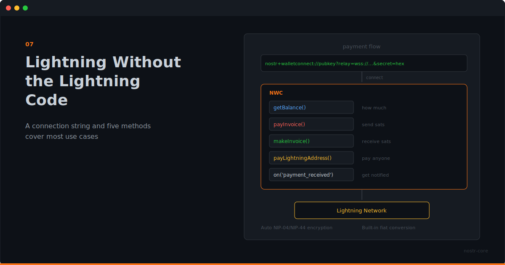

<p align="center">
  
</p>

# Lightning Without the Lightning Code

**You don't need to understand Lightning internals to accept and send payments. A connection string and five methods cover most use cases.**

---

## Lightning Is Powerful and Complicated

If you've ever set up a Lightning node, you know. Channel management, liquidity, routing, watchtowers, backups. It's powerful infrastructure, but it's a lot to take on when all you wanted was "let users pay for things."

Most app developers don't need to run a node. They need a payment API. Something that takes "pay this" and returns "paid," without requiring a degree in Lightning Network topology.

That's what NWC gives you. And nostr-core makes NWC trivial.

## The Connection String Is the Config

Someone else runs the wallet infrastructure. Maybe it's a service like Alby. Maybe it's a self-hosted setup. Maybe it's a Cashu mint behind [NUTbits](https://github.com/DoktorShift/NUTbits). You don't need to know or care.

They give you a connection string:

```
nostr+walletconnect://pubkey?relay=wss://...&secret=hex
```

That string contains the wallet's identity, the relay to communicate through, and your secret key. Paste it into nostr-core, and you have a wallet.

```ts
const nwc = new NWC(connectionString)
await nwc.connect()
```

Done. No node setup. No channel management. No liquidity planning.

## Five Methods for Most Apps

The reality is that most applications need a small set of payment operations. nostr-core covers them:

**Check the balance:**
```ts
const { balance } = await nwc.getBalance()
```

**Pay an invoice:**
```ts
const { preimage } = await nwc.payInvoice('lnbc...')
```

**Create an invoice:**
```ts
const { invoice } = await nwc.makeInvoice({ amount: 50000, description: 'Premium access' })
```

**Pay a Lightning address:**
```ts
await nwc.payLightningAddress('creator@example.com', 500)
```

**Listen for incoming payments:**
```ts
nwc.on('payment_received', (data) => {
  // Unlock content, update balance, send notification
})
```

That's it for most apps. A membership site needs `makeInvoice` and `payment_received`. A tipping feature needs `payLightningAddress`. A wallet dashboard needs `getBalance` and `listTransactions`.

## Fiat Conversion, Built In

Sometimes your users think in dollars, not sats. nostr-core handles conversion:

```ts
const { sats, rate } = await nwc.payLightningAddressFiat('shop@example.com', 25, 'usd')
console.log(`Paid ${sats} sats at $${rate}/BTC`)
```

Twenty-five dollars, converted to sats at the current rate, paid to a Lightning address. No extra dependencies. No separate API call for the exchange rate.

## What You Don't Write

Here's what nostr-core handles that you'd otherwise implement yourself:

- WebSocket connection to the Nostr relay
- Event creation, signing, and serialization
- Encryption negotiation (NIP-04 vs NIP-44)
- Request/response matching over async relay messages
- Timeout handling with specific error types
- Lightning Address resolution (LNURL-pay flow)
- Fiat-to-sats conversion via exchange rate API
- Connection lifecycle and cleanup

That's not a small amount of code. And it's the kind of code where subtle bugs create real problems: payments that hang, connections that leak, encryption that silently downgrades.

nostr-core has solved these problems once, with proper error handling and typed responses. You get the result.

## When You Need More

The NWC class covers the common cases. But nostr-core also exports the building blocks for when you need finer control.

Want to build a custom zap flow? NIP-57 exports zap request and receipt functions. Want to manage relay connections yourself? The Relay and RelayPool classes are available. Want to handle encryption manually for a specific use case? NIP-04 and NIP-44 are exported directly.

The high-level API gets you moving. The low-level exports let you go wherever you need.

## Payments Are Just Another Feature

The best payment integration is the one your users don't think about. They click "pay," it works, they move on.

nostr-core makes that possible by keeping the developer side equally simple. Import the class, connect with a string, call the method. The Lightning complexity stays where it belongs: in the wallet infrastructure, not in your application code.

---

**Lightning payments. One import. One connection string.** `npm install nostr-core`

**[GitHub](https://github.com/nostr-core-org/nostr-core)** · **[API Docs](https://github.com/nostr-core-org/nostr-core/tree/main/docs)**
