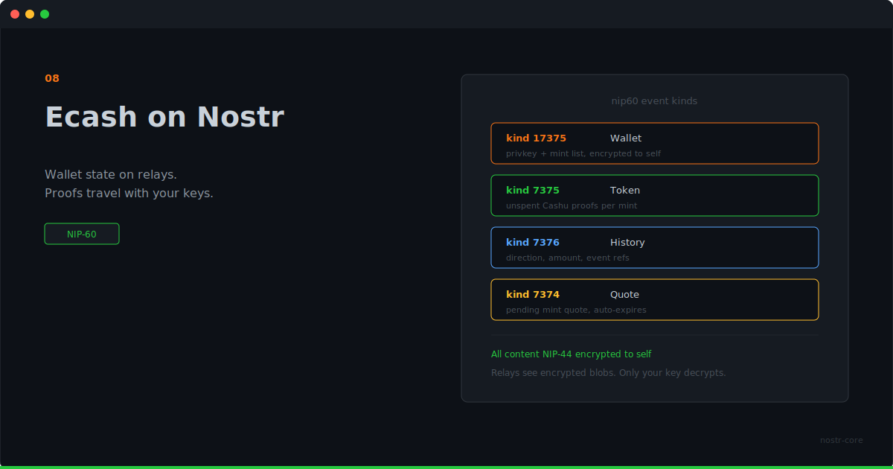

<p align="center">
  
</p>

# Ecash on Nostr

**Your wallet state lives on relays. Your proofs travel with your keys. No sync service. No device lock-in.**

---

## Wallets Have a Location Problem

Most wallets live on a device. Your phone, your laptop, a browser extension. The data sits in local storage. Lose the device, lose access. Switch devices, export and import. Use two devices, figure out sync.

NIP-60 stores wallet state as encrypted Nostr events. The same relays your social graph already lives on.

## How It Works

A NIP-60 wallet is four event kinds working together.

**Kind 17375** is the wallet itself. A replaceable event that holds the wallet's private key and a list of trusted mints. Encrypted to yourself with NIP-44. Only your Nostr key can read it.

**Kind 7375** is a token event. Each one holds unspent Cashu proofs for a single mint. Encrypted to self. This is where your actual balance lives, spread across however many token events you've accumulated.

**Kind 7376** is spending history. Records transactions with direction, amount, and references to the token events involved. The created and destroyed proofs are encrypted. Redeemed markers stay in plain tags so relays can filter.

**Kind 7374** is a quote event. Tracks pending mint quotes while a Lightning payment is in-flight. Uses NIP-40 expiration so stale quotes clean themselves up.

All encrypted content uses NIP-44's self-encryption pattern: derive a conversation key from your secret key to your own public key. Relays see encrypted blobs. Nobody else can read your wallet.

## What This Gets You

Log in with your Nostr key on any client that supports NIP-60. Your proofs are on the relays. Decrypt, sum the balances, show the wallet. No import file. No cloud backup. No sync service.

Switch from one Nostr client to another. Your ecash follows your identity, not your device.

Build a social client that also holds ecash. The user's proofs are already on the relays you're connected to. Read the token events, decrypt, show a balance. Spending means constructing a transaction with proofs the user already holds.

## nostr-core Has It

The implementation lives in `nip60.ts`. Create wallets, store tokens, record history, manage quotes, delete spent proofs, build relay filters. Typed end-to-end.

```ts
import { nip60 } from 'nostr-core'

// Create a wallet event
const wallet = nip60.createWalletEvent(
  { privkey: walletKey, mints: ['https://mint.example.com'] },
  secretKey
)

// Store ecash proofs
const token = nip60.createTokenEvent(
  { mint: 'https://mint.example.com', proofs: [...], unit: 'sat' },
  secretKey
)

// Sum a balance
const balance = nip60.getProofsBalance(proofs)

// Fetch wallet state from relays
const filters = nip60.getWalletFilters(pubkey)
```

Self-encryption, token deletion for spent proofs, history tracking with proper marker separation. The same NIP-44 encryption stack the rest of nostr-core uses.

## The Trust Model

Cashu ecash is custodial at the mint level. The mint holds the Bitcoin. NIP-60 doesn't change that. It changes where the wallet state lives, not the trust relationship.

Multi-mint support helps. Your wallet can hold proofs from different mints. One mint goes down, you lose that mint's ecash, not everything.

Ecash gives you privacy and portability. It asks you to trust a mint. Whether that works depends on your use case. Both things are true at the same time.

## The Bridge Already Exists

If you run a Cashu mint and want to make it available as an NWC wallet, [NUTbits](https://github.com/DoktorShift/NUTbits) does exactly that. It connects to your mint on one side and speaks Nostr Wallet Connect on the other. Any app that supports NWC sees a wallet. Your mint handles the Lightning.

That means a NIP-60 wallet holding ecash from your mint, and an NWC connection powered by the same mint through NUTbits, can coexist. Local ecash for direct transfers. NWC for Lightning reach. Same mint, two protocols, full coverage.

---

**Ecash wallets on Nostr relays. Encrypted, portable, ready.**

**[GitHub](https://github.com/nostr-core-org/nostr-core)** · **[NUTbits](https://github.com/DoktorShift/NUTbits)**
