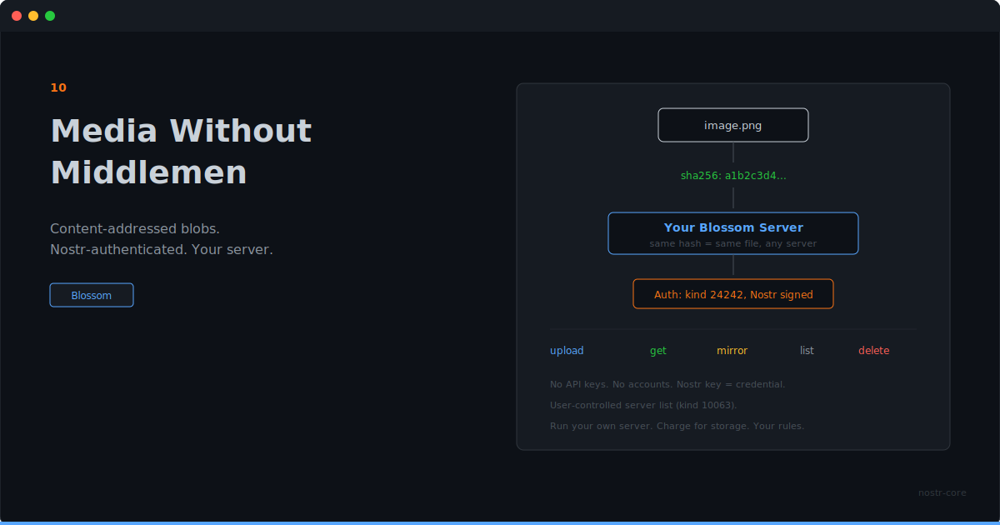

<p align="center">
  
</p>

# Media Without Middlemen

**Upload, retrieve, mirror, delete. Content-addressed blobs on Blossom servers, authenticated with your Nostr key.**

---

## Your Media Shouldn't Depend on One Server

Every image you post on a centralized platform lives at their URL, on their servers, under their rules. The link breaks when they change their infrastructure. The file disappears when they decide it should.

Blossom is different. Files are identified by their SHA-256 hash. The same file on any Blossom server has the same address. If one server goes down, any other server with the file can serve it. Content-addressed, decentralized, no single point of failure.

nostr-core speaks Blossom natively.

## What You Can Do

```ts
import { blossom } from 'nostr-core'

// Upload
const auth = blossom.createAuthEvent({
  action: 'upload',
  content: 'Upload image',
  expiration: Math.floor(Date.now() / 1000) + 300,
}, secretKey)

const blob = await blossom.uploadBlob('https://blossom.example', imageData, auth, 'image/png')
// blob.url, blob.sha256, blob.size

// Retrieve
const data = await blossom.getBlob('https://blossom.example', blob.sha256, '.png')

// Mirror to another server for redundancy
await blossom.mirrorBlob('https://backup.example', blob.url, mirrorAuth)

// Check, list, delete
await blossom.checkBlob('https://blossom.example', hash)
await blossom.listBlobs('https://blossom.example', pubkey)
await blossom.deleteBlob('https://blossom.example', hash, deleteAuth)
```

Six operations. Upload, get, check, list, delete, mirror. That covers every media workflow.

## Auth Is Just a Nostr Event

Blossom uses kind 24242 events for authorization. You sign an event that says what you want to do, when it expires, and optionally which files and servers it applies to. The server verifies the signature. No API keys, no tokens to manage, no OAuth.

Your Nostr identity is your credential. If you can sign events, you can use Blossom.

## What This Opens Up

**A social client with native media.** Users post images and videos. Your app uploads to their preferred Blossom servers (stored as a kind 10063 server list event). Files are content-addressed. If the user switches clients, their media is still there.

**Redundant storage with one function call.** Upload to your primary server. Mirror to a backup. Two servers, same hash, same file. If one dies, the other serves it.

**A marketplace with product images.** Sellers upload photos. Buyers see them. The images live on Blossom servers, identified by hash, authenticated by Nostr keys. No image hosting service needed.

**An archive that can't disappear.** Upload important files. Mirror them across multiple servers. The SHA-256 hash is the permanent address. As long as one server has the file, it's accessible.

## Server Lists

Users publish a kind 10063 event listing their preferred Blossom servers. Your app reads it and knows where to upload and where to look.

```ts
// Publish server preferences
const list = blossom.createServerListEvent(
  ['https://blossom.example', 'https://backup.example'],
  secretKey
)

// Read someone's server list
const servers = blossom.parseServerList(event)
```

This means media storage is user-controlled. They pick their servers. Your app respects their choice.

## Run Your Own, Charge for It

A Blossom server is infrastructure. Infrastructure you can monetize.

You run a server. You set the rules. Storage limits, file types, pricing. Users authenticate with their Nostr keys, upload media, and you earn for providing the service. No platform middleman taking a cut. No ad-supported model where you are the product.

Think of it like running a relay, but for media. Communities can run a shared Blossom server for their members. Photographers can offer premium storage. A podcast network can host episodes. A marketplace can store product images with redundancy built in.

The server operator controls the economics. Users control where their files go. Both sides get what they want.

## The Pattern

nostr-core keeps giving you the same thing: protocol primitives that work without deep Nostr knowledge. You don't need to understand BUD specs or construct authorization headers by hand. Import, call, ship.

Payments with NWC. Ecash with NIP-60. Media with Blossom. Social with NIPs 1 through 29. Identity, encryption, relay management. It's all the same package, the same types, the same patterns.

Build the thing you actually want to build. nostr-core handles the protocol.

---

**Content-addressed media. Nostr-authenticated. No middlemen.**

**[GitHub](https://github.com/nostr-core-org/nostr-core)**
