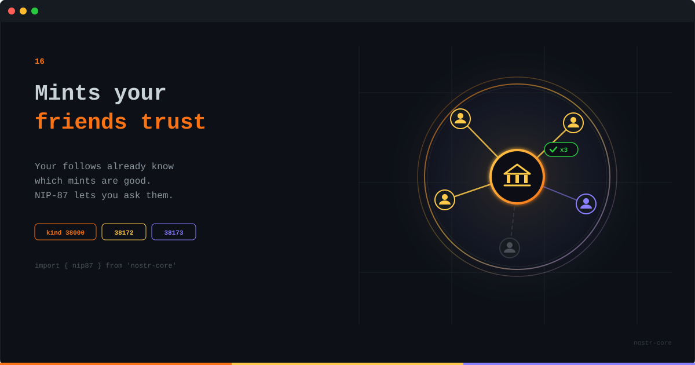

<p align="center">
  
</p>

# Finding Mints You Can Trust

**Your follows already know which mints are good. NIP-87 lets you ask them instead of a hardcoded list.**

---

## The List Nobody Chose

Every ecash wallet ships with a default mint list. Three entries, maybe five, picked by whoever cut the release. And defaults are destiny: most users tap the first entry and never think about it again. Multiply that across a few popular wallets and you get the quiet failure mode of ecash, a decentralized bearer instrument where half the network sits on the same two mints because a config file said so.

The mint question is the ecash question. A mint holds real money against the tokens it issues. Choosing one is a trust decision, and trust decisions don't belong in a hardcoded array.

## Mints Announce, People Vouch

NIP-87 splits discovery into two halves. Mints publish announcements: kind 38172 for Cashu, kind 38173 for Fedimint, carrying the URLs, the supported NUTs or modules, and the network. The `d` tag is the mint's own pubkey, so a mint keeps a stable identity even when announcements get mirrored around.

The second half is the part that matters: kind 38000 recommendations, published by people. Someone who has used a mint for a year can say so, in a signed event, with a free-form review attached. And because you know who signed it, you can weigh it the way you weigh everything else on Nostr: by whether you trust the author.

So discovery becomes a query against your own social graph:

```ts
import { nip87 } from 'nostr-core'

const recs = await pool.querySync(relays, nip87.getMintRecommendationFilter({
  authors: followList,
  kind: 38172,
}))

const counts = nip87.tallyRecommendations(recs)
const ranked = [...counts].sort((a, b) => b[1] - a[1])
```

`tallyRecommendations` counts distinct people per mint, not raw events. Someone who republishes their endorsement fifty times still counts once.

## Endorsements You Can Take Back

Recommendations are addressable, and that is not a technicality. Trust changes. A mint that ran flawlessly for two years gets sold, or gets slow, or gets weird about withdrawals. With addressable events, your endorsement is a living document: publish a new kind 38000 with the same identifier and the old one is gone. Withdraw it entirely and you stop vouching. The tally always reflects what people believe now, not what they believed once.

```ts
const rec = nip87.createMintRecommendation({
  identifier: mintPubkey,
  recommendedKind: 38172,
  connections: [{ url: 'https://cashu.example.com', label: 'cashu' }],
  content: 'Been using this for a year, no issues.',
}, secretKey)
```

## Don't Query the Firehose

There is a tempting shortcut: skip the recommendations and query kind 38172 directly. Here is every mint on the network, pick one. Don't. Anyone can publish an announcement, and an announcement is just a claim. Querying announcements raw bypasses the web of trust entirely, and pointing a user at a malicious mint is about the worst thing a wallet can do. Start from people, follow their `a` tag relay hints to the announcements, and treat an unvouched mint as exactly that.

## Where This Slots In

If you read the nutzap post, you saw that a kind 10019 event lists the mints you accept ecash from. NIP-87 is how that list gets filled with something better than guesswork. Your wallet queries your follows, ranks what comes back, shows you who vouched and what they said. The trust decision stays yours. It just stops being blind.

Hardcoded lists were how ecash bootstrapped. Social discovery is how it grows up.

---

**[GitHub](https://github.com/nostr-core-org/nostr-core)** · **[NIP-87 API](https://github.com/nostr-core-org/nostr-core/blob/main/docs/api/nip87.md)** · **[NIP-61 Nutzaps](https://github.com/nostr-core-org/nostr-core/blob/main/docs/api/nip61.md)**
