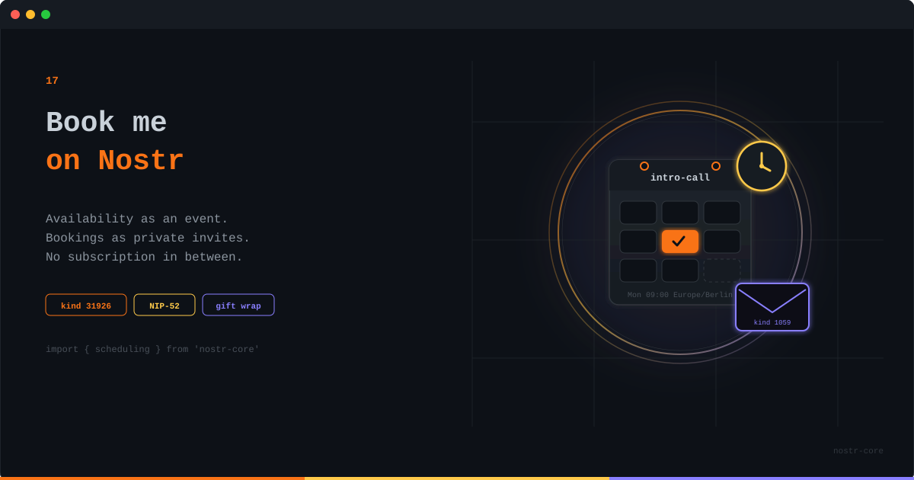

<p align="center">
  
</p>

# Book Me on Nostr

**An availability page that is an event. Bookings that are private calendar invites. No subscription in between.**

---

## The Meeting-Link Business

If you sell your time, a booking link is your storefront. Consultants, advisors, coaches, freelancers: "grab a slot" is how the money starts. Which is why an entire industry exists to host a page that says you're free on Wednesday afternoons.

Think about what that industry actually holds: your working hours, your client list, who met you and when, the notes they left while booking. All of it in a company's database, behind a monthly fee, gone if the account is. For the privilege of publishing the least secret information you own, your open calendar slots.

The new scheduling module in nostr-core takes that whole loop and rebuilds it on events you control.

## An Availability Page Is Just an Event

Your booking page becomes a kind 31926 addressable event: title, duration, timezone, and weekly rules in plain wall-clock time.

```ts
import { scheduling } from 'nostr-core'

const availability = {
  identifier: 'intro-call',
  title: '30 min intro',
  timezone: 'Europe/Berlin',
  durationMinutes: 30,
  rules: [
    { weekday: 1, start: '09:00', end: '12:00' },   // Mondays
    { weekday: 3, start: '14:00', end: '17:00' },   // Wednesdays
  ],
  bufferAfterMinutes: 10,
  minNoticeMinutes: 120,
  maxAdvanceDays: 60,
}

await pool.publish(relays, scheduling.createAvailabilityEvent(availability, secretKey))
```

Addressable means it replaces itself. Change your hours, publish again, and every client that reads the page sees the new schedule. There is no dashboard to log into, because there is no account.

## Slots That Survive October

Anyone who has built scheduling software has the same scar, and it's shaped like daylight saving time. Your rule says 09:00 in Berlin. In October, Berlin's UTC offset changes. Naive slot math either shifts your morning by an hour or generates a 02:30 slot on a night when 02:30 happens twice.

`generateSlots` treats rules as local wall-clock times and resolves each date through the IANA zone, using `Intl` under the hood, so there is no timezone package in your bundle. A 09:00 rule stays 09:00 local on both sides of a transition. A time that doesn't exist on spring-forward day simply produces no slot. Boring, correct, and nobody misses a call in March.

```ts
const now = Math.floor(Date.now() / 1000)
const slots = scheduling.generateSlots(page, {
  from: now,
  to: now + 14 * 86400,
  busy: scheduling.bookingsToBusy(acceptedBookings),
})
```

## The Booking Itself Is Nobody's Business

Your open slots are public. Who books them is not. A booking request is a NIP-52 calendar event wrapped in NIP-59 gift wrap, so the only thing a relay ever sees is an anonymous kind 1059 envelope. Not the participants, not the time, not the "would like to discuss the integration" note.

```ts
const { wraps } = scheduling.createBookingRequest({
  identifier: crypto.randomUUID(),
  availabilityAddress: scheduling.buildAvailabilityAddress(hostPubkey, 'intro-call'),
  host: hostPubkey,
  start: slots[0].start,
  end: slots[0].end,
  title: '30 min intro',
  timezone: 'Europe/Berlin',
}, bookerSecretKey)
```

You get one wrap for the host and a self-copy for the booker, so the appointment lives in both calendars. Cancellations work the same way, as a declined NIP-52 RSVP that either side can send.

## Trust the Page, Not the Request

One rule we'd underline twice: a booking request contains whatever times the booker chose to put in it. Nothing stops a hand-crafted request for Sunday at midnight. Your availability event is authoritative, the request is a wish. So the host always re-checks:

```ts
const ok = scheduling.isSlotAvailable(page, { start: booking.start, end: booking.end }, {
  busy: scheduling.bookingsToBusy(acceptedBookings),
})
```

Same discipline as any payment flow: validate on your side of the wire.

## Experimental, on Purpose

No NIP standardizes appointment scheduling yet, so the availability kind is provisional and overridable per call. Everything else deliberately reuses ratified pieces: bookings are ordinary NIP-52 calendar events, cancellations are ordinary RSVPs, and the transport is standard gift wrap. Your appointments stay readable by any calendar client that speaks NIP-52, whatever happens to the availability kind later.

Your hours were never the secret. The client list was. Now the public part is a signed event and the private part is actually private, and no one bills you monthly for the difference.

---

**[GitHub](https://github.com/nostr-core-org/nostr-core)** · **[Scheduling API](https://github.com/nostr-core-org/nostr-core/blob/main/docs/api/scheduling.md)** · **[NIP-52 Calendar](https://github.com/nostr-core-org/nostr-core/blob/main/docs/api/nip52.md)**
