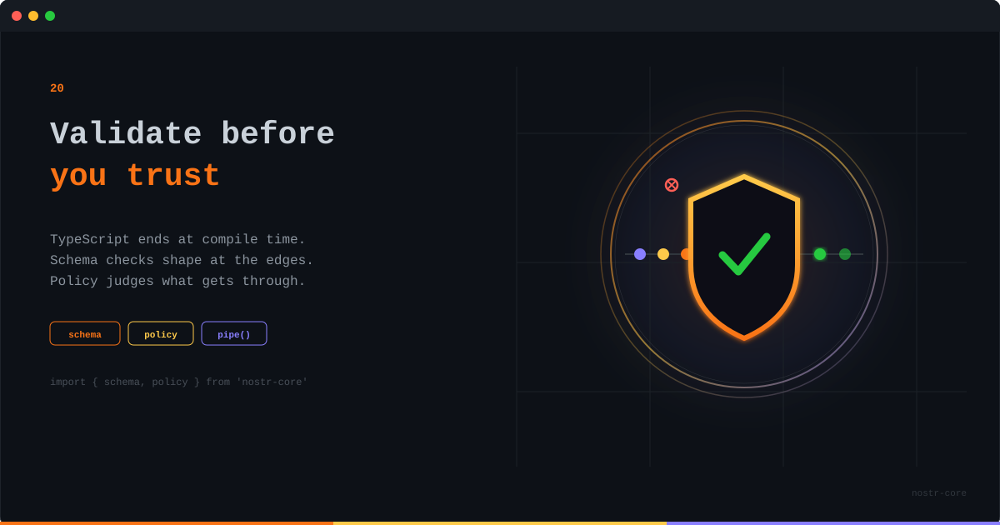

<p align="center">
  
</p>

# Validate Before You Trust

**TypeScript ends at compile time. Schema checks shape at the edges. Policy judges what gets through.**

---

## The Bug Three Layers Deep

The crash is in your rendering code. A `toLowerCase` on something that turned out to be a number, at the bottom of a stack trace that has nothing to do with the cause. The cause is that twenty minutes ago, some relay sent an event with `kind` as a string, your handler passed it along because TypeScript said the type was `NostrEvent`, and the lie traveled three layers before it hit something that cared.

Every type annotation on network data is a promise your compiler cannot keep. A relay, a wire message, a pasted JSON blob: TypeScript describes what they should be and has no opinion about what they are. This release adds the two modules that close that gap, one for shape and one for judgment.

## Schema: Shape at the Edges

Every validator in the `schema` namespace answers the same three ways: `is` for a type guard, `safeParse` when you want to know why, `parse` when you want to throw.

```ts
import { schema } from 'nostr-core'

socket.onmessage = (ev) => {
  const frame = schema.json(schema.relayMessage).safeParse(ev.data)
  if (!frame.ok) return   // garbage stays at the socket, where it arrived
  handle(frame.value)
}

const result = schema.nostrEvent.safeParse(incoming)
if (!result.ok) console.warn(result.issues)
// [{ path: 'id', message: 'expected 64 lowercase hex characters' }]
```

Issues come with a dotted path to the offending field, so the error message points at the actual problem instead of the eventual crash site. The filter validator even rejects unknown keys, which catches the classic silent typo: `kind` where you meant `kinds`, a filter that matches everything, and a very confusing afternoon.

## The Cache That Lied

Here is a bug from our own codebase, because this module exists for a reason. nostr-core caches signature verification on an internal symbol, so an event checked once is not checked again. Sensible. Except JavaScript's spread operator copies own symbols. Which means this:

```ts
const tampered = { ...signedEvent, content: 'changed' }
```

produces an event with different content and a stowaway flag still reading "already verified". Every spread of a verified event inherited a passed check it never took.

The fix ships in this release on two levels. `schema.verifiedNostrEvent` and the policy `requireValidSignature()` always verify from scratch, deliberately ignoring the cache: their whole job is judging untrusted input, so they must not take the event's word for it. And the new `verifyEventSignature` gives you the uncached primitive directly. The cache is still there for the hot path where you control the objects. At the trust boundary, nobody rides the cache.

## Policy: Judgment After Shape

A well-formed event can still be spam, a duplicate, expired, or from someone you blocked. Those are judgment calls, and the `policy` module makes them composable: each policy answers one question, `pipe` chains them, first rejection wins.

```ts
import { policy } from 'nostr-core'

// Built once, at startup - noDuplicates and rateLimit keep state.
const ingress = policy.pipe([
  policy.requireValidSignature(),
  policy.createdAtPolicy({ maxFutureSeconds: 900 }),
  policy.notExpired(),
  policy.sizeLimit({ maxContentLength: 64_000, maxTags: 2000 }),
  policy.noDuplicates(),
  policy.rateLimit({ max: 20, windowMs: 60_000 }),
  policy.blockKeywords(['spam', /free\s+bitcoin/i]),
])

const result = await ingress.check(event)
if (!result.accepted) send(['OK', event.id, false, result.reason])
```

Rejections come back NIP-01 style, `blocked: spam`, ready to put on the wire. Order is your performance dial: cheap timestamp checks first, signature math after, so junk gets discarded before it costs you anything.

## The Same Tools, Client Side

Nothing here is relay-only. The same pieces make a feed filter with actual opinions:

```ts
const feed = policy.pipe([
  policy.notExpired(),
  policy.anyOf([
    policy.pubkeyAllowList(followList),   // people I follow, always
    policy.requirePow(16),                // strangers pay for attention
  ]),
  policy.blockKeywords(mutedWords),
])
```

Follows get through free. Strangers spend NIP-13 proof of work to reach you. Moderation logic stops being a bespoke `shouldAccept()` that grows a new `if` every month, and becomes a list you can read aloud.

We once wrote that Nostr needs boring infrastructure. This is what boring looks like at the trust boundary: check the shape, judge the content, and let nothing skip the line because a type annotation vouched for it.

---

**[GitHub](https://github.com/nostr-core-org/nostr-core)** · **[Schema API](https://github.com/nostr-core-org/nostr-core/blob/main/docs/api/schema.md)** · **[Policy API](https://github.com/nostr-core-org/nostr-core/blob/main/docs/api/policy.md)**
